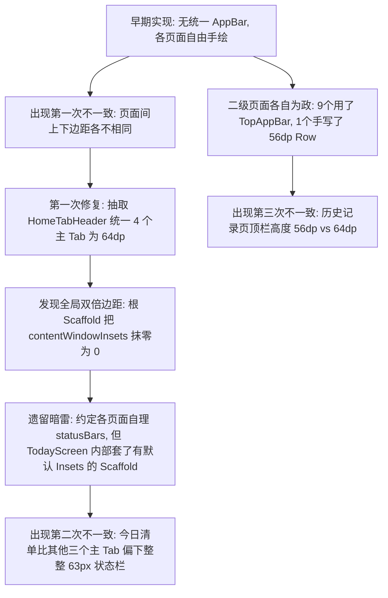
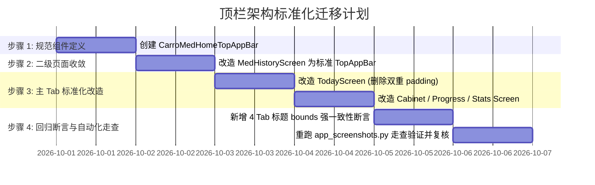

# 顶栏（TitleBar / TopAppBar）架构与标准化方案深度分析

> **文档状态**：调研与方案分析（未改动任何代码）  
> **编写时间**：2026-09-30  
> **涉及范围**：全应用 4 个主 Tab、10 个二级全屏页面、`AppNavigation` 根架构、Insets 协议

---

## 〇、执行摘要（Executive Summary）

1. **问题的本质**：
   本项目屡次出现顶栏高度、间距、位置不一致（如“今日清单比药箱靠上”、“今日清单比药箱偏下 63px”、“历史记录顶栏偏矮 8dp”），根源**不是官方 AppBar 有缺陷**，而是工程内**缺少统一的顶栏架构协议**，导致存在 **4 种截然不同、互相冲突的实现范式**，并且混用了两种不兼容的 WindowInsets 消费机制。
2. **是否应改用官方推荐做法**：
   **必须全面改用 Material 3 官方推荐的 TopAppBar 架构体系**。
   目前 9 个使用官方 `TopAppBar` 的二级页面高度和 Insets 完全一致且从未出过 Bug；所有出 Bug 的页面，全都是手写自绘、脱离官方 `Scaffold.topBar` 槽位规范的页面。
3. **对既有方案（`ANALYSIS-APPBAR-INSET-20260930.md`）的客观评析**：
   - **正确之处**：该文档对 `TodayScreen`“状态栏被计入两次导致偏下 63px”的实测测量、算术反推与 M3 字节码分析非常精准扎实，确证了 Insets 混乱的物理诱因。
   - **盲点与偏差**：该文档推崇的“方案 C（将所有主 Tab 顶栏上移到根 Scaffold `AppNavigation`）”存在严重的**架构坏味道（Architecture Smell）**：
     - 导致导航路由层与各个子页面的状态/事件严重耦合（如导出、添加、设置、排序菜单）；
     - 彻底打破 Compose 官方推崇的**单页面自治（Self-contained Screen）**原则；
     - 破坏所有单屏 UI 预览（`@Preview`）与屏幕级快照测试（`ScreenSnapshotTest`）；
     - 误将“主 Tab 顶栏随列表滚走”这一早期的临时实现当作“必须保留的既有设计决策”（实际上主流 App 绝无此类反人类交互）。
4. **推荐实施方案**：
   采用**“组件化自治架构（Screen-level Scaffold + 统一设计规范组件）”**：
   - 抽取主 Tab 专用顶栏组件 `CarroMedHomeTopAppBar`（基于 M3 `TopAppBar` 标准封装，固定 64dp 高度，统一标题排版与右侧操作按钮，自动消费 `WindowInsets.statusBars`）；
   - 4 个主 Tab 在各自页面内通过标准的 `Scaffold(topBar = { CarroMedHomeTopAppBar(...) })` 承载，常驻吸顶；
   - 修复 `MedHistoryScreen` 的 56dp 手写 Row，回归标准的 64dp `TopAppBar`；
   - 废除所有手写的 `.statusBarsPadding()`，内容列表统一消费 `innerPadding`。

---

## 一、现状代码调研与混乱根因剖析

### 1.1 全应用顶栏现状横向对比

经全面检索，当前工程共 14 个页面，其顶栏实现分裂为以下 **4 种完全不同的范式**：

| 页面类别 | 页面名称 | 顶栏载体 | 高度规范 | 状态栏 Inset 消费方式 | 滚动表现 | 视觉一致性状态 |
|:---|:---|:---|:---|:---|:---|:---|
| **主 Tab 1** | 今日清单 (`TodayScreen`) | 内部空壳 `Scaffold` + `LazyColumn` 第一个 item（`HomeTabHeader`） | 64dp + 4dp contentPadding | **双重叠加**（Scaffold innerPadding.top + `.statusBarsPadding()`） | 随列表滚出屏幕 | ❌ **偏下 63px**（双倍状态栏） |
| **主 Tab 2~4** | 我的药箱、进展追踪、统计报表 | 无 Scaffold，直接 `LazyColumn` 第一个 item（`HomeTabHeader`） | 64dp + 4dp contentPadding | 页面直接在 LazyColumn 上调 `.statusBarsPadding()` | 随列表滚出屏幕 | ⚠️ 3 页高度一致，但与今日不一致 |
| **二级页面 (9个)** | 药品详情、设置、新增/编辑、库存、手动补录、补药、提醒设置、记录详情、权限自检 | 页面级 `Scaffold(topBar = { TopAppBar(...) })` | 64dp (M3 规范默认值) | `TopAppBar` 内部自动消费 `TopAppBarDefaults.windowInsets` | 常驻吸顶 | ✅ **完全统一，从未出过 Inset Bug** |
| **二级页面 (特异)** | 历史记录 (`MedHistoryScreen`) | 页面级 `Scaffold(topBar = { Row(...) })` | **56dp (手写硬编码)** | 手写 Row 上加 `.statusBarsPadding()` | 常驻吸顶 | ❌ **偏矮 8dp**，左侧返回与文字间距异构 |

### 1.2 为什么屡次出现高度与位置不一致？

梳理代码提交历史与现有实现，问题的根本演进路径如下：



#### 根因 1：协议割裂 —— 有的使用官方 `topBar` 槽位，有的当成列表普通 item
- 官方 `Scaffold` 设计的核心思想是：**`topBar` 是一个独立的布局槽位（Slot）**。
- 当传入 `topBar` 时，Scaffold 会测量 topBar 的高度（已含状态栏），并在计算暴露给主体的 `innerPadding.top` 时，**将 topBar 的高度全部赋给 innerPadding.top**，使内容刚好紧接在 topBar 下方。
- 而 4 个主 Tab 将顶栏放在 `LazyColumn` 的 `item { HomeTabHeader(...) }` 内，Scaffold 没有识别到 topBar，导致 Scaffold 认为页面没有顶栏，走的是“将状态栏高度直接赋给 innerPadding.top”的分支。

#### 根因 2：双重消费（Double Padding）陷阱
在 `TodayScreen.kt:133-139`：
```kotlin
Scaffold(
    snackbarHost = { ... },
    floatingActionButton = { ... }
) { innerPadding ->
    LazyColumn(
        modifier = Modifier
            .fillMaxSize()
            .padding(innerPadding)    // 第一次：吃了内层 Scaffold 默认的 statusBars（63px）
            .statusBarsPadding()      // 第二次：又手动加了一次状态栏高度（63px）
            .padding(horizontal = 16.dp),
        contentPadding = PaddingValues(top = 4.dp, bottom = 120.dp),
        ...
    )
```
而 `CabinetScreen.kt`、`ProgressScreen.kt`、`StatsScreen.kt` 根本没有内部 Scaffold，只加了一次 `.statusBarsPadding()`。
**这就是为什么今日清单在真机上测量出来的标题 top bounds 是 180，而其余三个 Tab 是 117（180 - 117 = 63px，正好是 density=2.625 下的 24dp 状态栏）！**

#### 根因 3：历史记录页的“野路子”手写 Row
在 `MedHistoryScreen.kt:71-76`：
```kotlin
Scaffold(
    topBar = {
        Row(
            modifier = Modifier
                .fillMaxWidth()
                .statusBarsPadding()
                .height(56.dp),  // 错误：M3 标准 TopAppBar 高度为 64.dp，此处硬编码 56.dp
            verticalAlignment = Alignment.CenterVertically
        ) { ... }
    }
)
```
这导致二级页面内部也出现了分裂：9 个页面高 64dp，1 个页面高 56dp。用户在点击进入历史记录页时，顶栏高度发生明显收缩跳变。

---

## 二、官方推荐做法（Official Material 3 & Jetpack Compose）

Google Android 官方在 Jetpack Compose 和 Material 3 体系中，经过数个大版本的演进（尤其是配合 Android 15 全面强制 Edge-to-Edge），给出了极为明确的标准指引：

### 2.1 组件体系：Material 3 TopAppBar 家族

M3 提供了 4 种标准的 TopAppBar：
1. **`TopAppBar` (Small TopAppBar)**：单行紧凑型，容器高度固定为 **64.dp**。标题位于左侧或紧随导航图标。适用于大多数二级页面和需要最大化阅读区域的列表页。
2. **`CenterAlignedTopAppBar`**：单行紧凑型，容器高度 **64.dp**，标题强制居中。通常用于单任务流、弹窗或特定风格界面。
3. **`MediumTopAppBar`**：两行折叠型，初始展开高度 **112.dp**，向上滚动时平滑折叠为 64.dp。
4. **`LargeTopAppBar`**：大标题折叠型，初始展开高度 **152.dp**，向上滚动时平滑折叠为 64.dp。常用于层级最高的主页面（如主 Tab、个人中心）。

### 2.2 官方 Insets 消费闭环原理

在启用 `enableEdgeToEdge()` 后，官方的设计架构形成了完美的自洽闭环：

```
[Window Insets 树] (statusBars = 24dp)
         │
         ▼
[TopAppBar (默认 windowInsets = TopAppBarDefaults.windowInsets)]
         │──> 内部测量：自身的 64dp + 状态栏 24dp = 总高度 88dp
         │──> 消费掉 statusBars 区域
         ▼
[Scaffold 布局管理器]
         │──> 检测到 topBar 存在且高度为 88dp
         │──> 计算暴露给内容的 innerPadding：
         │      innerPadding.top = 88dp (即 topBarHeight)
         │      innerPadding.bottom = bottomBarHeight
         ▼
[Body Content (LazyColumn)]
         │──> 使用 Modifier.padding(innerPadding) 或 contentPadding = innerPadding
         │──> 内容的第一项精确起始于 88dp 处，既不被顶栏遮挡，也不多吃任何间距！
```

**官方铁律**：
- **凡是顶栏，必须放在 `Scaffold.topBar` 槽位中**；
- **顶栏内部使用 `windowInsets` 消费状态栏，禁止在外部布局或内容区再调用 `.statusBarsPadding()`**；
- **内容列表只需要处理 `innerPadding`**。

---

## 三、主流 App 是怎么做的？

调研国内外一线主流 App（如 Google 系列应用、Telegram、微信、网易云音乐、Twitter/X 等）以及优秀开源 Compose 工程（如 Google 官方开源架构示范 `Now in Android`）：

### 3.1 核心疑问：主 Tab 的标题栏到底滚不滚动？

| 实现方式 | 代表应用 | 用户体验与人机工学分析 | 是否推荐 |
|:---|:---|:---|:---|
| **常驻吸顶 (Pinned TopBar)** | Google 绝大多数应用、微信、Telegram、网易云音乐、iOS 系统应用标准 | **极佳**。顶栏是页面的**地标（Identity）**与**高频全局操作出口**（搜索、设置、新建等）。用户滑动到列表深处时，随时知道自己在哪里，随时可以触达操作按钮。Tab 间切换时视觉锚点稳定，绝不跳动。 | **强烈推荐（业界基准）** |
| **滚动折叠 (Collapsing Large Title)** | iOS 备忘录/健康、部分 Android 原生 M3 应用 (`LargeTopAppBar`) | **优良**。静止在顶部时呈现醒目大标题，向上滚动时标题平滑缩小并吸顶（不消失）。兼顾了大字号美感与吸顶便利。 | **可选（若追求高级动效）** |
| **当成列表项滚走 (Scrollable Header)** | 仅极少数内容沉浸流详情页（如长文章、图片信息流） | **极差**。列表滑下去后，顶栏彻底消失：用户不知道当前在哪个 Tab；想要点击右上角的“设置”、“新建”、“导出”必须拼命往上滑或者点击回顶按钮；从滑过的 Tab 切到未滑过的 Tab 时，顶栏位置瞬移。 | ❌ **严重反人类，非主流做法** |

### 3.2 架构模式：全局单个 Scaffold vs 页面级独立 Scaffold

在基于 Navigation Compose 的架构中，主流 App 的顶栏结构通常有两种形态：

1. **形态 A：通用外层顶栏（Global Shell TopBar）**
   - 整个应用只有最外层一个 Scaffold，包含一个统一的 TopAppBar。
   - **适用场景**：所有页面的顶栏风格、操作极度单一（例如整个 App 只有标题和一个全局搜索框）。
   - **缺点**：子页面一旦有独特的 action（比如有的页面要显示保存按钮、有的要显示排序下拉、有的要弹出菜单），子页面就必须通过状态提升把一堆回调和 ViewModel 穿透传给根路由，破坏模块解耦。
2. **形态 B：各 Screen 自治 Scaffold（Self-contained Screen Scaffold）**
   - 外层导航仅负责整体路由切换和一级底栏（`NavigationBar`）；
   - 每个 Screen 作为一个独立的 UI 单元，内部拥有自己的 `Scaffold(topBar = { ... })`；
   - **适用场景**：各页面的顶栏标题、操作按钮、交互逻辑各不相同的通用复杂应用。
   - **优点**：
     - **高度内聚，零泄漏**：页面的 Action（如 `viewModel.exportReport()`、`viewModel.saveSettings()`）直接在 Screen 内部闭环，不需要层层回调上抛到 `AppNavigation`；
     - **快照测试与 UI Preview 完美支持**：单测或 Compose Preview 可以独立渲染一个完整的 Screen，不需要把外层导航依赖一起 mock；
     - **一二级页面完全同构**：无论是一级 Tab 还是二级页面，都遵循“Screen 自带 Scaffold + topBar”的唯一协议。

---

## 四、对已有方案 `ANALYSIS-APPBAR-INSET-20260930.md` 的客观评析

在进行上述系统性推演后，对照阅读 `docs/ANALYSIS-APPBAR-INSET-20260930.md`，对其提出的结论与方案做如下客观对比：

### 4.1 值得肯定的工作与事实
1. **实测数据确凿**：通过 ADB 和语义树导出测量出 `Today` 偏下 63px，准确锁定了问题只出在 `TodayScreen` 的内层 Scaffold 与 statusBarsPadding 叠加。
2. **字节码分析深入**：深入分析了 M3 源码中 `Scaffold` 在 `topBarPlaceables.isEmpty()` 为真时的降级逻辑，揭示了 Compose 内部的 Insets 传递机制。
3. **识别了 `MedHistoryScreen` 的 56dp 异构问题**：发现了第 3 派自绘 Row 的存在，并提出了统一诉求。

### 4.2 存在重大偏差与不合理的论点（“不一定对”的地方）

#### 偏差 1：误将历史遗留代码当成“刻意的设计决策”
- **原文件论点**：
  > “当前 `HomeTabHeader` 有两个刻意的设计决策，官方 `TopAppBar` 不支持：1. 随列表滚动…… 这是已经生效的一致性成果，不该推翻。”
- **反驳与纠偏**：
  查阅 `CHANGES-20260927.md` 可知，当时抽 `HomeTabHeader` 仅仅是为了解决 4 个主 Tab 之间文字大小和按钮不对齐的问题，顺手写成了一个 Row 塞进列表。这只是一个**临时的快速修补方案（Quick Fix）**，绝不是经过深思熟虑的“刻意人机交互决策”。
  把顶栏塞在列表里滚走，造成了严重的交互缺陷。如果为了“守旧”而坚持让主 Tab 顶栏随列表滚走，是因噎废食。

#### 偏差 2：草率推崇“方案 C（顶栏上移根 Scaffold）”，引入架构灾难
- **原文件结论**：
  原文件排除了方案 B，力推方案 C，主张把 4 个 Tab 的 TopAppBar 搬到 `AppNavigation.kt` 中统一渲染。
- **方案 C 的致命缺陷**：
  1. **状态逆流与紧耦合（Coupling Hell）**：
     看当前 4 个主 Tab 的 actions：
     - `TodayScreen`：操作是设置（需跳 Settings）；
     - `CabinetScreen`：操作是加药（跳 AddMedication），更关键的是它下面还紧跟着搜索框与排序下拉框；
     - `ProgressScreen`：操作是空；
     - `StatsScreen`：操作是导出报表，其点击事件为 `viewModel.exportReport()`，需要直接触发 `StatsViewModel`！
     如果在 `AppNavigation` 写 `topBar`，`AppNavigation` 就必须持有 `StatsViewModel` 或者通过 callback 穿透，路由层瞬间沦为业务垃圾场。
  2. **破坏测试基线与 UI 独立性**：
     原文档自己也承认：“`ScreenSnapshotTest` 的 5 张基线会失去标题，因为该测试直接调用 `TodayScreen(...)`，不经过 `AppNavigation`”。
     如果把顶栏移到 `AppNavigation`，所有的单屏组件测试全部瘫痪，必须给每一个 Screen 在测试里写一个 Fake Scaffold 才能测顶栏。这是严重的架构倒退！
  3. **一二级页面架构异构**：
     一级 Tab 的顶栏在 `AppNavigation`，二级页面的顶栏在子 Screen 内。一个工程存在两套顶栏宿主规则，新人接手将无所适从。

#### 偏差 3：对方案 B（各页自治 TopAppBar）的否决理由完全不成立
- **原文件否决方案 B 的理由**：
  > “顶栏固定后与滚动列表内容重叠，且 4 个 tab 各写一遍 Scaffold，标题来源仍是 4 处，物理上仍可能漂移。”
- **反驳**：
  1. “顶栏固定后与滚动列表内容重叠”？—— 只要使用标准的 `Scaffold(topBar = { ... }) { innerPadding -> LazyColumn(modifier = Modifier.padding(innerPadding)) }`，或者 `contentPadding = innerPadding`，顶栏和列表内容**由 Compose 测量系统保证绝对不可能重叠**！现有的 9 个二级页面全是这样写的，没有一个重叠。
  2. “标题来源仍是 4 处”？—— 4 个 Tab 本来就是 4 个不同的业务页面，今日就叫“今日清单”，药箱就叫“我的药箱”，本就应该来自各自页面的定义。
  3. 通过抽取统一的 `CarroMedHomeTopAppBar` 组件，规格（64dp、样式、内边距、状态栏消费）由该组件唯一收口，各页面只要传 `title` 和 `onActionClick`，**物理上没有任何漂移空间**。

---

## 五、综合对比与决策矩阵

| 评估维度 | 方案 A：局部修补<br>（只修 TodayScreen 双倍 padding） | 方案 C（原文档推荐）：<br>顶栏强行上移到根 Scaffold | **方案 D（本文推荐）：<br>组件化自治架构（规范组件 + 页面级 Scaffold）** |
|:---|:---|:---|:---|
| **改动成本** | 极低（改 3 行代码） | 极高（重构根导航、破坏快照单测、上拉 ViewModel 依赖） | **适中**（统一抽一个组件，各 Tab 接入标准槽位） |
| **Insets 彻底解决度** | ⚠️ 治标不治本（靠纪律禁止内层加 Scaffold） | ✅ 彻底解决 | ✅ **彻底解决（全量走 M3 标准协议）** |
| **顶栏交互规范** | ❌ 仍随列表滚走，不符合现代 App 习惯 | ✅ 固定吸顶 | ✅ **固定吸顶（符合主流标准）** |
| **模块解耦与架构健康度** | ⚠️ 一般（各页实现不统一） | ❌ **极差**（路由层与子页业务 ViewModel 强耦合） | ✅ **最佳（Screen 独立自治，零逆向耦合）** |
| **单元测试与 Preview 友好度** | ✅ 现有测试不受影响 | ❌ **严重破坏**（ScreenSnapshotTest 全挂，Preview 丢顶栏） | ✅ **最佳**（每个 Screen 独立自包含完整顶栏，Preview 即所见） |
| **全应用范式一致性** | ❌ 依然分裂为三派 | ⚠️ 一二级页面宿主依然异构 | ✅ **100% 同构（4 主 Tab + 10 二级页统一遵循同一模式）** |

---

## 六、推荐解决方案与落地路线图

### 6.1 核心设计：组件化自治架构

#### 1. 抽取主 Tab 专用顶栏规范组件：`CarroMedHomeTopAppBar`
废弃只作为普通布局的 `HomeTabHeader`，将其升级为合法的 M3 `TopAppBar` 封装：

```kotlin
// ui/component/CarroMedTopAppBar.kt (设计示意)
@OptIn(ExperimentalMaterial3Api::class)
@Composable
fun CarroMedHomeTopAppBar(
    title: String,
    actionIcon: ImageVector,
    actionContentDescription: String,
    onActionClick: () -> Unit,
    modifier: Modifier = Modifier
) {
    TopAppBar(
        title = {
            Text(
                text = title,
                style = MaterialTheme.typography.headlineMedium,
                fontWeight = FontWeight.Bold,
                color = MaterialTheme.colorScheme.onBackground
            )
        },
        actions = {
            IconButton(
                onClick = onActionClick,
                modifier = Modifier
                    .padding(end = 8.dp)
                    .size(44.dp)
                    .clip(CircleShape)
                    .background(MaterialTheme.colorScheme.surfaceVariant)
            ) {
                Icon(
                    imageVector = actionIcon,
                    contentDescription = actionContentDescription,
                    tint = MaterialTheme.colorScheme.onSurfaceVariant
                )
            }
        },
        // 关键点：遵循 M3 官方默认，自动消费状态栏 Insets
        windowInsets = TopAppBarDefaults.windowInsets,
        colors = TopAppBarDefaults.topAppBarColors(
            containerColor = MaterialTheme.colorScheme.background
        ),
        modifier = modifier
    )
}
```

#### 2. 主 Tab 页面全面标准化接入
以 `TodayScreen` 和 `CabinetScreen` 为例：

```kotlin
// TodayScreen.kt 标准化后形态
@Composable
fun TodayScreen(...) {
    Scaffold(
        snackbarHost = { SnackbarHost(snackbarHostState) },
        topBar = {
            CarroMedHomeTopAppBar(
                title = stringResource(R.string.today_title),
                actionIcon = Icons.Outlined.Settings,
                actionContentDescription = stringResource(R.string.today_cd_settings),
                onActionClick = onNavigateToSettings
            )
        },
        floatingActionButton = { ... }
    ) { innerPadding ->
        LazyColumn(
            modifier = Modifier
                .fillMaxSize()
                .padding(innerPadding)            // 唯一消费 innerPadding
                .padding(horizontal = 16.dp),
            contentPadding = PaddingValues(top = 8.dp, bottom = 120.dp), // 删掉 statusBarsPadding()!
            verticalArrangement = Arrangement.spacedBy(14.dp)
        ) {
            // 不再需要 item { HomeTabHeader(...) }
            item { DateSelectorRow(...) }
            ...
        }
    }
}
```

同理，`CabinetScreen`、`ProgressScreen`、`StatsScreen` 均采用此标准结构。

#### 3. 收敛二级页面的手写 Row：`MedHistoryScreen`
将 `MedHistoryScreen.kt` 的手写 56dp Row 替换为标准 M3 `TopAppBar`：
```kotlin
// MedHistoryScreen.kt 标准化后形态
Scaffold(
    topBar = {
        TopAppBar(
            title = {
                Column {
                    Text(
                        text = uiState.medication?.name ?: stringResource(R.string.mhist_title),
                        fontWeight = FontWeight.Bold,
                        maxLines = 1
                    )
                    Text(
                        text = stringResource(R.string.mhist_title),
                        style = MaterialTheme.typography.labelSmall,
                        color = MaterialTheme.colorScheme.onSurfaceVariant
                    )
                }
            },
            navigationIcon = {
                IconButton(onClick = onNavigateBack) {
                    Icon(Icons.AutoMirrored.Filled.ArrowBack, contentDescription = stringResource(R.string.mhist_cd_back))
                }
            },
            colors = TopAppBarDefaults.topAppBarColors(containerColor = MaterialTheme.colorScheme.background)
        )
    }
) { innerPadding ->
    ...
}
```

### 6.2 迁移实施路线图（分步计划）



### 6.3 防回归守护机制（Guardrails）

为确保“高度与位置不一致”的问题永远不再复发，必须建立以下双重防护体系：

1. **自动化语义断言（`SmokeNavigationTest`）**：
   在自动化测试中增加 Tab 切换专项用例：连续切换 4 个主 Tab，获取各页面标题 Text 的语义节点，断言其 `getUnclippedBoundsInRoot().top` 严格全等（例如允许误差不超过 1px）。
2. **走查工具横向对齐比对（`tools/app_screenshots.py`）**：
   在现有的截图自动化走查脚本中，增加顶栏坐标检查逻辑，输出一份表格直接校验所有全屏页面的 `appBarBounds.top` 与 `appBarBounds.height`。

---

## 七、总结与行动建议

1. **我们现在的做法有问题吗？**  
   **有严重问题。** 主 Tab 顶栏作为列表 item 随滑动手势滚走，违反了现代移动端人机交互规范；同时 Insets 处理各自为政，在 `TodayScreen` 引发了双倍状态栏间距 Bug；二级页面还遗留了 56dp 的非标自绘 Row。
2. **是否应该改用官方推荐做法？**  
   **应当立即全面收敛至官方 M3 TopAppBar 架构。** 官方机制在 Android 沉浸式 Edge-to-Edge 环境下具备完整的自动测量和 Inset 闭环支持。
3. **架构选型的最终定论**：  
   **坚决反对将子页面顶栏强行上提到根导航层（反对原文档方案 C）**；  
   **坚定推行“组件化自治架构”（实施本文推荐方案 D）**，以最低的侵入性、最佳的模块解耦性和最彻底的协议规范，彻底终结本项目的顶栏不一致顽疾。
