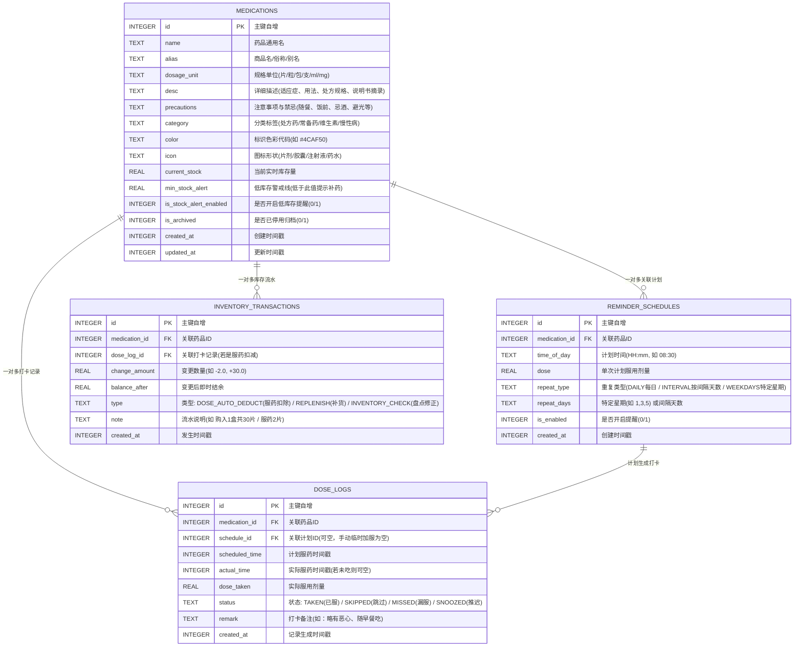

# CarroMed - 本地离线用药提醒与库存健康助手方案设计

> ⚠️ **本文档已于 2026-09-27 废弃（SUPERSEDED）**
> 本文的数据模型（REMINDER_SCHEDULES / DOSE_LOGS）、统计口径与里程碑已被最终设计取代。
> 当前唯一权威源：
> - 产品功能与范围：`docs/FINAL-PRODUCT-20260927-qwa.md`
> - 系统架构与数据模型：`docs/FINAL-ARCHITECTURE-20260927-qwa.md`
> - 界面与交互：`docs/FINAL-UI-20260927-qwa.md`
> 废弃原因详见 `docs/PLAN-REVIEW-20260927-qwa.md`、`docs/DESIGN_REVIEW_dsf.md`、`docs/DESIGN_REVIEW.sbf.md`。本文仅作历史存档保留。

> **版本**：v1.0.0  
> **文档位置**：`docs/APP_DESIGN_SPEC.md`  
> **定位**：纯本地离线、零广告、免登录、注重隐私、毫秒级响应的 Android 专属服药/待办管理工具。  
> **设计初衷**：彻底解决 MyTherapy 等传统商业软件“强依赖登录、广告打扰、启动慢、药品描述/注意事项不够用、库存无自动闭环、长周期统计受限、数据无法自主导出”等核心痛点。

---

## 目录
1. [系统总体架构 (System Architecture)](#一系统总体架构-system-architecture)
2. [本地数据建模 (Database Schema)](#二本地数据建模-database-schema)
3. [Android 精准提醒与保活机制](#三android-精准提醒与保活机制)
4. [核心功能特性设计](#四核心功能特性设计)
5. [页面结构与交互线框 (Pages & Wireframes)](#五页面结构与交互线框-pages--wireframes)
6. [长周期统计与报表算法 (Analytics Engine)](#六长周期统计与报表算法-analytics-engine)
7. [数据导入导出与备份恢复 (Export & Backup)](#七数据导入导出与备份恢复-export--backup)
8. [开发与实施里程碑 (Implementation Plan)](#八开发与实施里程碑-implementation-plan)

---

## 一、系统总体架构 (System Architecture)

应用采用标准的 **分层架构（Layered Architecture）**，保持高度解耦与单向数据流。所有数据纯本地存储在应用沙箱内，不建立任何远程网络连接。

```
┌─────────────────────────────────────────────────────────────┐
│                    UI 层 (Presentation)                     │
│  - Material 3 Design (适配深浅色与动态色彩 Material You)     │
│  - 响应式布局 (状态驱动页面渲染)                            │
│  - 状态管理: Riverpod / ValueNotifier                       │
└──────────────────────────────┬──────────────────────────────┘
                               │
┌──────────────────────────────▼──────────────────────────────┐
│                    业务逻辑层 (Domain / BLoC)                │
│  - 提醒排程调度器 (Scheduler Engine)                         │
│  - 库存自动扣减与事务结算 (Inventory Engine)                 │
│  - 历史打卡与补录逻辑 (Dose Tracking Engine)                │
│  - 统计聚合与多维分析引擎 (Analytics Engine)                 │
│  - 本地 CSV / JSON 导出导入器 (Backup & Export)              │
└──────────────────────────────┬──────────────────────────────┘
                               │
┌──────────────────────────────▼──────────────────────────────┐
│                     数据层 (Data / Repository)              │
│  - 仓储接口与实现 (MedicationRepo, DoseLogRepo, etc.)        │
│  - SQLite ORM: Drift (类型安全、支持响应式 Stream 查询)      │
└──────────────────────────────┬──────────────────────────────┘
                               │
┌──────────────────────────────▼──────────────────────────────┐
│                 底层驱动与系统接口 (Platform Services)       │
│  - Android AlarmManager (精准低功耗定时唤醒)                 │
│  - Android NotificationManager (高优先级通知渠道、浮动通知)  │
│  - BroadcastReceiver (开机自启 BOOT_COMPLETED 闹钟恢复)      │
│  - App 私有存储沙盒 (/data/user/0/.../app_flutter/)         │
└─────────────────────────────────────────────────────────────┘
```

---

## 二、本地数据建模 (Database Schema)

基于 SQLite (通过 Drift ORM 驱动)，设计严密的外键级联与流水账表结构，确保库存变动可追溯、服药历史不丢失。



---

## 三、Android 精准提醒与保活机制

为了杜绝 Android 系统（特别是 MIUI/HyperOS、ColorOS、OriginOS、HarmonyOS）深度休眠杀后台导致吃药漏提醒的问题，采用多重保障方案：

### 1. 闹钟核心机制
* **精确唤醒**：使用 `AlarmManager.setExactAndAllowWhileIdle()`，在设备进入 Doze 深度休眠时依然能唤醒 CPU 执行通知触发。
* **权限声明**：
  * Android 12+ 适配：声明 `android.permission.SCHEDULE_EXACT_ALARM`。
  * Android 14+ 适配：视场景申请 `USE_EXACT_ALARM`，并在启动时主动引导用户检查“允许闹钟与提醒”权限。
* **开机广播恢复 (`BOOT_COMPLETED`)**：
  * 手机重启会导致系统清理所有闹钟。注册 `BootReceiver`，在开机广播触发后，无感读取数据库，瞬间将未来的提醒重新注入 `AlarmManager`。

### 2. 高优先级常驻通知渠道
* **通知级别**：渠道配置 `IMPORTANCE_HIGH` 或 `IMPORTANCE_MAX`，锁屏亮屏、顶部横幅浮动通知（Heads-up Notification）。
* **通知内快捷操作（不用打开 App 即可交互）**：
  * 按钮 1：`「已吃」` → 后台广播直接更新打卡状态为 TAKEN，扣减库存，关闭通知并发出提示音。
  * 按钮 2：`「推迟 15 分钟」` → 重新注册 15 分钟后的临时精确闹钟。
  * 按钮 3：`「跳过本次」` → 更新状态为 SKIPPED，不扣减库存。

### 3. 系统保活引导指引页
* 专设“防漏提醒自检页”，一键跳转系统设置项：
  * 电池管理：将 CarroMed 设置为“无限制 / 忽略电池优化”。
  * 自启动管理：开启“允许自启动 / 关联启动”。
  * 锁屏显示与悬浮通知权限。

---

## 四、核心功能特性设计

### 1. 详细描述与注意事项 (解决 MyTherapy 字段单一痛点)
* **详细描述 (`desc`)**：
  * 支持长文本与要点列表，记录完整的适应症、医生处方嘱托、药品规格别名等。
* **注意事项与警示 (`precautions`)**：
  * 高显眼卡片展示，支持预置快捷标签 + 自定义输入：
    * 常用标签：`随餐服用`、`饭前空腹`、`饭后30分钟`、`服药忌酒`、`睡前服用`、`不能与牛奶同服`、`避免日晒` 等。
  * 在「今日提醒列表」和「通知横幅」中直接展示注意事项核心摘要，防止吃错。

### 2. 闭环式库存管理 (自动扣减 + 警戒阈值)
* **自动扣减**：每次打卡确认服药，系统在本地事务中将对应药品的 `current_stock` 扣减单次剂量，同时记录 `INVENTORY_TRANSACTIONS` 流水。
* **撤销机制**：如果误触“已吃”，在打卡撤销时自动回滚库存。
* **低库存预警**：
  * 药品设定 `min_stock_alert`（如剩余 10 片时预警）。
  * 首页顶部以醒目药箱徽标提示“有 2 种药品库存不足，请及时补充”。
* **一键快捷补药**：在药品详情页点击“补药”，输入新增数量（如增加 1 盒 24 片），即刻完成入库。

---

## 五、页面结构与交互线框 (Pages & Wireframes)

应用主体采用 **底部四 Tab 导航**，结构清晰，单手操作极佳：

```
                      ┌────────────────────────┐
                      │    CarroMed 主应用     │
                      └───────────┬────────────┘
                                  │
      ┌────────────────┬──────────┴─────┬────────────────┐
      │                │                │                │
┌─────▼──────┐   ┌─────▼──────┐   ┌─────▼──────┐   ┌─────▼──────┐
│  今日服药  │   │  药品库存  │   │  历史日历  │   │  统计报表  │
│  (Today)   │   │  (Meds)    │   │ (History)  │   │ (Reports)  │
└─────┬──────┘   └─────┬──────┘   └─────┬──────┘   └─────┬──────┘
      │                │                │                │
┌─────▼──────┐   ┌─────▼──────┐         │          ┌─────▼──────┐
│ 快捷加服   │   │ 药品详情   │         │          │ 数据导出   │
│ 弹窗       │   │ (注意事项) │         │          │ (CSV/备份) │
└────────────┘   └─────┬──────┘         │          └────────────┘
                       │                │
                 ┌─────▼──────┐   ┌─────▼──────┐
                 │ 补药 / 编辑│   │ 补卡/详情  │
                 └────────────┘   └────────────┘
```

---

### 1. Tab 1：今日服药 (Today Screen)

用户日常最高频打开的页面，聚焦于“今天该吃什么”、“什么时候吃”、“注意事项是什么”。

```
+-------------------------------------------------------+
|  CarroMed                            [防漏设置] [⚙ 设置] |
|  2026年9月27日 星期日                                 |
+-------------------------------------------------------+
|  [今日进度: 已完成 2/4 次] ▓▓▓▓▓▓▓▓░░░░░░░░  50%       |
|  [⚠️ 2种药品库存告急: 阿司匹林(剩3片)]                |
+-------------------------------------------------------+
|  早晨 08:00                                           |
|  +-------------------------------------------------+  |
|  | [💊] 硝苯地平控释片 (30mg)               已按时吃 |  |
|  |      用法: 每次 1 片 | 实际 08:05 服用           |  |
|  |      💡 注意事项: 整片吞服，严禁嚼碎            |  |
|  +-------------------------------------------------+  |
+-------------------------------------------------------+
|  中午 12:30                                           |
|  +-------------------------------------------------+  |
|  | [💊] 阿莫西林胶囊 (0.5g)              剩余 25分钟 |  |
|  |      用法: 每次 2 粒 (当前库存剩 6 粒)          |  |
|  |      ⚠️ 注意事项: 饭后服用，注意有无皮疹过敏    |  |
|  |                                                 |  |
|  |      [ 已吃 (扣库存) ]   [ 推迟 15m ]   [ 跳过 ] |  |
|  +-------------------------------------------------+  |
+-------------------------------------------------------+
|  晚上 20:00                                           |
|  +-------------------------------------------------+  |
|  | [💧] 复合维生素 B 片 (100片装)                     |  |
|  |      用法: 每次 1 片 | 随晚餐或餐后服用          |  |
|  |      [ 已吃 (扣库存) ]   [ 推迟 15m ]   [ 跳过 ] |  |
|  +-------------------------------------------------+  |
+-------------------------------------------------------+
|                                  [ + 临时加服/记水 ]   |
|   [今日服药]       [药品库存]       [历史日历]     [统计] |
+-------------------------------------------------------+
```

---

### 2. Tab 2：药品与库存管理 (Medications Screen)

药品资产中心，集中管理所有药品的详细信息、注意事项、以及精确库存。

```
+-------------------------------------------------------+
|  药品与库存库                          [🔍 搜索] [➕ 新建] |
|  全部 (8)  |  正在服用 (6)  |  低库存 (2)  |  已归档 (2) |
+-------------------------------------------------------+
|  +-------------------------------------------------+  |
|  | [💊] 阿莫西林胶囊 (抗生素)            [库存告急 ⚠️] |  |
|  |      库存: 6 粒 / 警戒线 10 粒                      |  |
|  |      进度: ▓▓▓░░░░░░░░░░░░░░░░░░░  约可用 1.5 天   |  |
|  |      计划: 每日 2 次，每次 2 粒                     |  |
|  |      注意事项: 随餐服用、禁酒、完成整个疗程        |  |
|  +-------------------------------------------------+  |
|  +-------------------------------------------------+  |
|  | [💧] 人工泪液滴眼液 (外用)              [库存充足] |  |
|  |      库存: 18 支 / 警戒线 5 支                      |  |
|  |      计划: 每日 3 次，每次 1 滴                     |  |
|  |      注意事项: 开封后30天内用完、勿接触瓶口        |  |
|  +-------------------------------------------------+  |
|  +-------------------------------------------------+  |
|  | [💊] 维生素 D3 软胶囊                   [库存充足] |  |
|  |      库存: 45 粒 / 警戒线 15 粒                     |  |
|  |      计划: 每日 1 次，每次 1 粒                     |  |
|  +-------------------------------------------------+  |
+-------------------------------------------------------+
|   [今日服药]       [药品库存]       [历史日历]     [统计] |
+-------------------------------------------------------+
```

#### 页面 2.1：药品详情与注意事项展示 (Medication Detail)
点击单个药品后进入，承载用户对**大段描述与注意事项**的核心诉求：

```
+-------------------------------------------------------+
|  < 返回                   药品详情         [编辑] [归档]|
+-------------------------------------------------------+
|  [💊 蓝色] 阿莫西林胶囊 (Amoxicillin)                  |
|  分类: 处方药 · 抗生素 | 规格: 0.25g * 24粒/盒          |
+-------------------------------------------------------+
|  📌 详细描述 (Description)                            |
|  适用于敏感菌所致的呼吸道感染、尿路感染、皮肤软组织感染|
|  等。属于广谱青霉素类药物，按疗程服用不可随意停用。   |
+-------------------------------------------------------+
|  ⚠️ 注意事项与禁忌 (Precautions) [重要高亮]            |
|  • 用药前必须确认无青霉素过敏史。                     |
|  • 建议饭后半小时温水送服，减少胃肠道刺激。           |
|  • 服药期间严禁饮酒及含酒精饮料。                     |
|  • 如出现皮疹、瘙痒或呼吸困难立即停药并就医。         |
+-------------------------------------------------------+
|  📦 库存状态与流水                                     |
|  当前剩余: 6 粒 (警戒阈值: 10 粒)    [ + 快捷补药入库 ] |
|  [最近流水记录]                                        |
|  • 09-27 08:05  服药自动扣除: -2 粒 (结余: 6)         |
|  • 09-26 20:00  服药自动扣除: -2 粒 (结余: 8)         |
|  • 09-20 10:00  手动补货入库: +24 粒 (结余: 30)       |
+-------------------------------------------------------+
|  ⏰ 提醒计划 (每日 2 次)                               |
|  • 08:00 (用量 2 粒)   [已开启]                        |
|  • 20:00 (用量 2 粒)   [已开启]                        |
+-------------------------------------------------------+
```

---

### 3. Tab 3：历史日历与时间轴 (History & Calendar Screen)

提供日历与时间轴两种视角，便于用户复盘过去某一天具体的服药情况或进行补录打卡。

```
+-------------------------------------------------------+
|  历史记录                             [📅 切换视图]    |
|  << 2026年 9月 >>                                     |
|   一   二   三   四   五   六   日                     |
|  21   22   23   24   25   26   27                     |
|  🟢   🟢   🟡   🟢   🟢   🟢   🔵(今)                  |
|  (🟢 全按时  🟡 有推迟/漏服  🔴 严重漏服  ⚪ 无计划)   |
+-------------------------------------------------------+
|  2026-09-27 (今天) 详细打卡时间轴                      |
|  +-------------------------------------------------+  |
|  | 08:05 (计划 08:00)                  [✅ 已按时服] |  |
|  | 硝苯地平控释片 (1片)                                |  |
|  | 备注: 随早餐温水服用                               |  |
|  +-------------------------------------------------+  |
|  | 12:30 (计划 12:30)                  [⏳ 待服用]   |  |
|  | 阿莫西林胶囊 (2粒)                                  |  |
|  | [立即打卡]  [调整时间]                              |  |
+-------------------------------------------------------+
|                                      [ + 补录以往记录] |
|   [今日服药]       [药品库存]       [历史日历]     [统计] |
+-------------------------------------------------------+
```

---

### 4. Tab 4：统计分析与报告 (Analytics & Reports Screen)

**完全满足“统计过去一个月、一年吃了多少药”的核心需求**。

```
+-------------------------------------------------------+
|  统计报告                                [ 📤 导出报告 ]|
|  [ 过去 7 天 ]  [ 过去 30 天 ]  [ 过去 1 年 ]  [ 自定义 ]|
+-------------------------------------------------------+
|  📊 总体服药依从性看板 (2025.09.28 ~ 2026.09.27)      |
|                                                       |
|       ╭──────╮      按时服药率: 92.4%                 |
|     │  92%   │      计划总次数: 730 次                |
|       ╰──────╯      已按时服用: 675 次 | 漏服: 25 次   |
+-------------------------------------------------------+
|  💊 年度各药品实际消耗总量统计 (过去 1 年)              |
|                                                       |
|  1. 硝苯地平控释片                                     |
|     累计消耗: 360 片  (按时率 98%)                    |
|     月均消耗: 30.0 片 | 涉及补药 15 盒                |
|                                                       |
|  2. 维生素 D3 软胶囊                                  |
|     累计消耗: 180 粒  (按时率 95%)                    |
|     月均消耗: 15.0 粒                                 |
|                                                       |
|  3. 阿莫西林胶囊 (短期抗生素)                          |
|     累计消耗: 42 粒   (2个完整疗程)                   |
+-------------------------------------------------------+
|  📈 月度服药趋势对比 (每月消耗片数折线/柱状图)          |
|  片数                                                 |
|   60 |        ■   ■                                   |
|   40 |    ■   ■   ■   ■   ■   ■   ■   ■   ■   ■   ■   |
|   20 |    ■   ■   ■   ■   ■   ■   ■   ■   ■   ■   ■   |
|    0 +-------------------------------------------->   |
|      10月 11月 12月 1月 2月 3月 4月 5月 6月 7月 8月 9月 |
+-------------------------------------------------------+
|   [今日服药]       [药品库存]       [历史日历]     [统计] |
+-------------------------------------------------------+
```

---

## 六、长周期统计与报表算法 (Analytics Engine)

所有统计查询均由本地 SQLite 高性能 SQL 驱动，毫秒级聚合一年甚至数万条记录：

### 1. 依从性计算公式
$$\text{服药依从率 (Adherence Rate)} = \frac{\text{状态为 TAKEN 且实际服药时间在合理窗口内的打卡数}}{\text{计划应服药总次数}} \times 100\%$$

* **准时窗口定义**：计划时间前后 60 分钟内打卡视为“准时”；超过视为“推迟服用”；全天未打卡视为“漏服 (Missed)”。

### 2. 药品消耗量聚合查询（以指定区间为例）
```sql
SELECT 
    m.id AS medication_id,
    m.name AS medication_name,
    m.dosage_unit AS unit,
    SUM(d.dose_taken) AS total_consumed,
    COUNT(CASE WHEN d.status = 'TAKEN' THEN 1 END) AS taken_count,
    COUNT(CASE WHEN d.status = 'MISSED' THEN 1 END) AS missed_count,
    COUNT(CASE WHEN d.status = 'SKIPPED' THEN 1 END) AS skipped_count
FROM medications m
JOIN dose_logs d ON m.id = d.medication_id
WHERE d.scheduled_time BETWEEN :start_timestamp AND :end_timestamp
GROUP BY m.id
ORDER BY total_consumed DESC;
```

---

## 七、数据导入导出与备份恢复 (Export & Backup)

用户数据 100% 归用户所有，提供两种导出模式：

### 1. CSV 表格导出 (方便用户就诊出示或在 Excel 中深入分析)
* 导出内容 1：`medication_intake_history_YYYYMMDD.csv`（详细打卡流水，包含：日期时间、药品名、规格剂量、实际服用时间、状态、注意事项、就诊医生备注等）。
* 导出内容 2：`medication_summary_report_YYYYMMDD.csv`（月度/年度汇总，包含：药品名称、年度总吃药量、按时率、漏服次数）。
* 支持调用 Android 系统分享直接发送给微信、QQ、网盘或保存到手机本地 Downloads 目录。

### 2. JSON 全量镜像与换机迁移 (Backup & Restore)
* 一键生成 `carromed_backup_YYYYMMDD_HHmmss.json`。
* 包含完整的 SQLite 镜像数据（药品、计划、打卡历史、库存流水）。
* 换新手机后，只需在 CarroMed 安装后点击“从本地文件还原”，3 秒内无缝恢复所有配置与历史数据。

---

## 八、开发与实施里程碑 (Implementation Plan)

在获得你的方案确认后，进入分步实现：

| 阶段 | 核心任务与交付物 | 预计成果 |
| :--- | :--- | :--- |
| **Milestone 1** | 初始化 Flutter Android 项目、配置 SQLite/Drift 数据库与 DAO 层 | 数据库底层打通，支持单元测试 |
| **Milestone 2** | 药品库 CRUD、详细描述与注意事项、库存录入与出入库流水 | 药品与库存管理页面完工 |
| **Milestone 3** | Android 精准提醒通知 (`AlarmManager` + 锁屏快捷操作 + 重启恢复) | 锁屏/后台准时响铃与快捷打卡 |
| **Milestone 4** | 今日计划列表、打卡联动库存扣减、历史日历视图 | 核心服药打卡闭环跑通 |
| **Milestone 5** | 月度/年度统计分析图表 (`fl_chart`)、CSV 表格导出、JSON 完整备份 | 统计报告与数据自由导出就绪 |
| **Milestone 6** | Android 电池白名单检测引导、UI 视觉打磨、无障碍与真机调试 | 交付稳定 release APK |
