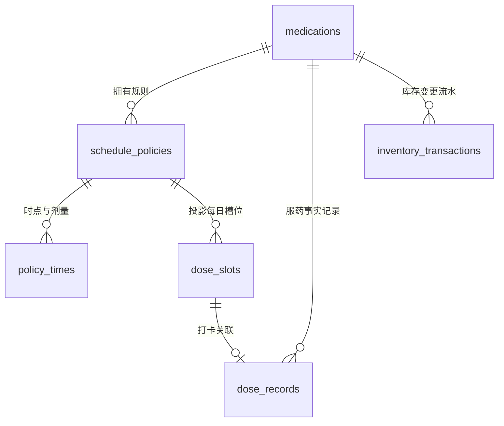

# CarroMed 最终设计 · 二：系统架构 (FINAL-ARCHITECTURE)

> **版本**：v3.1.0（原生 Android 极简加固终稿）  
> **文档位置**：`docs/FINAL-ARCHITECTURE.md`  
> **性质**：本文档为**数据模型、状态机、原生调度机制、统计口径、备份规范的唯一技术权威源**。  
> **重大架构决策**：本项目**全量采用原生 Android (Kotlin + Jetpack Compose + Room + Coroutines/Flow)** 架构，彻底消灭跨语言交互与双端 SQL 维护成本。  
> **设计原则**：架构清晰、绝不繁琐、提醒可靠、时序解耦、低输入门槛（字段充分预留但大部可选）。

---

## 目录

1. [技术栈选型与原生分层架构](#一技术栈选型与原生分层架构)
2. [数据模型规范 (Room 5+1 表设计)](#二数据模型规范-room-51-表设计)
3. [状态机与不变量 (极简闭环)](#三状态机与不变量-极简闭环)
4. [槽位生成与对账 (Reconciler)](#四槽位生成与对账-reconciler)
5. [提醒调度与原生降级链路](#五提醒调度与原生降级链路)
6. [通知栏直写与极速交互](#六通知栏直写与极速交互)
7. [统计口径规范 (权威定义)](#七统计口径规范-权威定义)
8. [库存流水账本机制](#八库存流水账本机制)
9. [备份与恢复规范](#九备份与恢复规范)
10. [系统权限矩阵](#十系统权限矩阵)
11. [里程碑与验收标准](#十一里程碑与验收标准)

---

## 一、技术栈选型与原生分层架构

### 1.1 为什么原生 Jetpack Compose 是最优解？
本项目明确**只支持 Android 单端**。在此前提下，原生 Android 相比跨平台方案具有决定性优势：
1. **消灭“双头数据层”矛盾**：在 Flutter 方案中，锁屏后台通知栏点“已吃”时，必须在原生 BroadcastReceiver 几十毫秒内写入 SQLite，导致 Dart(Drift) 与 Kotlin 两套数据库代码双向重复维护。**原生 Compose + Room 仅有唯一的 Kotlin 数据层**，类型安全 100%，维护成本降低一半。
2. **极速启动与极低资源消耗**：APK 体积仅 5~8MB（Flutter 需 20~30MB），内存底噪仅 20MB，冷启动 <300ms，如同系统内置闹钟一般轻盈。
3. **通知栏 Action 零延迟响应**：用户在系统通知栏点击“已吃/推迟”，Kotlin 协程在 15ms 内完成 Room 事务，绝无拉起跨平台引擎超时被杀的风险。
4. **天然支持现代声明式 UI 与桌面小部件**：Jetpack Compose 声明式开发效率与 Flutter 完全一致，且未来若需扩展桌面 Widget（通过 Jetpack Glance），零技术壁垒。

### 1.2 系统分层架构

```
┌──────────────────────────────────────────────────────────┐
│ UI 层 (Jetpack Compose + Material 3)                     │
│   - 响应式 UI 组件 (@Composable)                         │
│   - 状态持有与单向数据流 (ViewModel + StateFlow)          │
├──────────────────────────────────────────────────────────┤
│ 领域与仓储层 (Domain & Repositories)                      │
│   - MedicationRepository / DoseRepository / StockRepo    │
│   - 对账器 (ScheduleReconciler)                          │
│   - 统计聚合与 CSV/JSON 备份引擎                          │
├──────────────────────────────────────────────────────────┤
│ 数据层 (Room Database - 统一单一真理源)                  │
│   - AppDatabase (WAL 模式，支持 Flow 实时响应)           │
│   - TypeSafe DAOs: MedicationDao, DoseSlotDao, etc.      │
├──────────────────────────────────────────────────────────┤
│ 平台系统集成 (Android System Services)                    │
│   - AlarmManager (setExactAndAllowWhileIdle / setAlarmClock)
│   - BroadcastReceiver (DoseActionReceiver, BootReceiver)  │
│   - NotificationManager (高优先级通知渠道、Heads-up)      │
└──────────────────────────────────────────────────────────┘
```

---

## 二、数据模型规范 (Room 5+1 表设计)

摒弃过度设计的双表折叠事件溯源，收敛为 **5 张核心业务表 + 1 张应用设置表**。  
**字段设计原则**：字段充分预留（方便后续无感扩展），但在日常录入和 UI 上**绝大部分均为可选，仅药品名和时间必填**。



### 2.1 `medications`（药品主表）

| 字段 | 类型 | 必填/可选 | 默认值 | 说明 |
| :--- | :--- | :--- | :--- | :--- |
| id | Long PK (自增) | 必填 | 0 | 药品唯一主键 |
| name | String | **必填** | - | 药品名称（Title，如 环孢素） |
| alias | String? | 可选 | null | 预留：商品名/俗称（如 新山地明） |
| category | String? | 可选 | "常备药" | 预留：药品分类标签 |
| form | String | 可选 | "TABLET" | 剂型（TABLET/CAPSULE/LIQUID/DROP/INJECTION），映射图标 |
| strength_text | String? | 可选 | null | 规格描述（如 "0.25g*24粒/盒"，仅展示） |
| dosage_unit | String | 可选 | "片" | 单位（片/粒/袋/支/ml） |
| stock_milli | Long | 可选 | 0L | 当前库存（整数毫单位缓存，1.5片=1500） |
| min_stock_milli | Long | 可选 | 0L | 低库存警戒线（0 表示不开启警戒预警） |
| stock_tracking_enabled | Boolean | 可选 | false | 库存追踪总开关（默认关闭，用户想管库存才开） |
| description | String? | 可选 | null | 描述（用法、说明、医生嘱托） |
| precaution_tags | String? | 可选 | null | 注意事项标签（JSON 数组，如 `["随餐","忌酒"]`） |
| notice_short | String? | 可选 | null | 通知短句（≤20字，横幅提醒时优先展示） |
| color_hex | String | 可选 | "#3B82F6" | 标识卡片颜色 |
| paused_until | String? | 可选 | null | 暂停提醒至某本地日期 YYYY-MM-DD（null 为正常） |
| is_archived | Boolean | 必填 | false | 软归档标志（停药归档，绝不物理删除历史） |
| created_at / updated_at | Long | 必填 | System.currentTimeMillis() | 时间戳 |

### 2.2 `schedule_policies`（排程规则表）

| 字段 | 类型 | 说明 |
| :--- | :--- | :--- |
| id | Long PK (自增) | 规则主键 |
| medication_id | Long FK | 关联药品 ID |
| version | Int | 版本号（改医嘱换表时递增） |
| frequency_type | String | `DAILY`(每日) / `INTERVAL`(隔N天) / `WEEKDAYS`(每周特定天) / `AS_NEEDED`(按需) |
| interval_days | Int | 隔 N 天用（1 为隔日，2 为隔 2 天） |
| anchor_date | String? | 基准日期 YYYY-MM-DD |
| weekdays | String? | 每周特定天（如 "1,3,5"） |
| effective_from_date | String | 规则生效起始本地日期 YYYY-MM-DD |
| effective_until_date | String? | 规则失效截止日期（null 为永久） |
| punctual_window_min | Int | 准时判定窗口（默认 60 分钟） |
| created_at | Long | 创建时间戳 |

### 2.3 `policy_times`（规则时间点子表）

| 字段 | 类型 | 说明 |
| :--- | :--- | :--- |
| id | Long PK (自增) | 主键 |
| policy_id | Long FK | 关联规则 ID |
| time_of_day | String | "HH:mm"（如 "08:30"） |
| dose_milli | Long | 单次剂量毫单位（默认 1000 = 1 片） |

### 2.4 `dose_slots`（任务槽位表——可再生缓存，核心调度基石）

| 字段 | 类型 | 说明 |
| :--- | :--- | :--- |
| id | Long PK (自增) | 槽位唯一标识；闹钟身份已改**内容寻址**（`carromed://alarm/{medId}/{date}/{time}/{kind}`，requestCode 恒为 0），id 不再直接作为 RequestCode |
| medication_id | Long FK | 关联药品 ID |
| policy_id | Long FK | 关联规则 ID |
| scheduled_date | String | 本地日期 YYYY-MM-DD（统计与日历的核心归属键） |
| scheduled_ts | Long | 计划时间戳（毫秒） |
| dose_milli | Long | 计划剂量毫单位快照 |
| status | String | `PENDING`(待服) / `SNOOZED`(推迟中) / `TAKEN`(已服) / `SKIPPED`(跳过) / `EXPIRED`(未确认过期) / `CANCELLED`(改计划取消) |
| snooze_until | Long? | 推迟目标时间戳（毫秒） |
| record_id | Long? | 打卡后关联的 `dose_records.id` |
| updated_at | Long | 更新时间戳 |

* **唯一约束**：`UNIQUE(medication_id, scheduled_ts, policy_id)`，确保槽位生成与对账绝对幂等，不重复发闹钟。

### 2.5 `dose_records`（服药事实表——单表完成全部统计）

| 字段 | 类型 | 说明 |
| :--- | :--- | :--- |
| id | Long PK (自增) | 主键 |
| medication_id | Long FK | 关联药品 ID |
| slot_id | Long? | 关联槽位 ID（按需临时服药为空） |
| med_name_snapshot | String | 打卡时的药品名快照 |
| scheduled_ts | Long? | 计划时间戳 |
| actual_ts | Long | 实际服药打卡时间戳 |
| dose_milli | Long | 实际服用剂量毫单位 |
| status | String | `COMPLETED`(有效服用) / `CANCELLED`(误触已撤销) |
| source | String | `APP`(主页打卡) / `NOTIFICATION`(通知栏快捷打卡) / `MANUAL`(补录) |
| note | String? | 备注 |
| created_at / updated_at | Long | 时间戳 |

> **极简优化**：直接在记录表使用 `status = CANCELLED` 表达撤销，统计时只需 `WHERE status = 'COMPLETED'`，无需多建一张复杂的 `adjustments` 差额折叠表！

### 2.6 `inventory_transactions`（库存记账流水表）

| 字段 | 类型 | 说明 |
| :--- | :--- | :--- |
| id | Long PK (自增) | 主键 |
| medication_id | Long FK | 关联药品 ID |
| record_id | Long? | 关联的打卡记录 ID |
| delta_milli | Long | 变动毫单位（扣减为负，入库为正） |
| type | String | `OPENING_BALANCE`(期初) / `AUTO_DEDUCT`(服药扣除) / `REVERT_ROLLBACK`(撤销回滚) / `REPLENISH`(补药) / `MANUAL_ADJUST`(校准) |
| idempotency_key | String UNIQUE | 幂等防重键（如 `deduct:slot:123`） |
| note | String? | 备注 |
| created_at | Long | 时间戳 |

---

## 三、状态机与不变量 (极简闭环)

### 3.1 槽位状态转移规则
```
               ┌── 确认吃药 ──▶ TAKEN (写入 dose_records，扣减库存)
               ├── 跳过本次 ──▶ SKIPPED
[ PENDING ] ───┼── 推迟 30m/1h ─▶ SNOOZED (重排临时闹钟，≤3次) ──超限──▶ EXPIRED
               ├── 规则变更 ──▶ CANCELLED (取消未来待发闹钟)
               └── 超过结算线 ──▶ EXPIRED (不扣减库存，移入待补录区)

[ TAKEN ]   ─── 点击撤销 ────▶ PENDING (原记录标 CANCELLED，库存流水加回)
```

### 3.2 核心不变量（自动化测试守护）
1. **账本恒等**：开启库存追踪时，`medications.stock_milli == SUM(inventory_transactions.delta_milli)`（整数完全匹配，零误差）。
2. **规则区间不重叠**：同一药品在任意本地日期，有效规则版本至多一条。
3. **撤销与防重幂等**：通知栏双击或并发连击，通过 `idempotency_key` 保证只扣除一次库存。

---

## 四、槽位生成与对账 (Reconciler)

1. **惰性按需补齐**：进入应用时，检查今天及未来 7 天内有效规则覆盖的槽位，若不存在则**批量幂等插入** `dose_slots`。
2. **中途改计划差分对齐**：
   - 规则变动只影响**当前时刻之后处于 `PENDING` 状态的槽位**；
   - 今天早些时候已打卡为 `TAKEN` 的槽位**绝对不动**；
   - 废弃的旧时点槽位标记为 `CANCELLED` 并调用 `AlarmManager.cancel()`。
3. **过期槽位判定（EXPIRED）**：
   - 计划时间过去 2 小时且仍为 `PENDING` 的槽位，系统标记为 `EXPIRED`（绝不冤枉判为漏服，今日页保留补录按钮）。

---

## 五、提醒调度与原生降级链路

使用原生 Kotlin 调度，三档自动降级，确保 100% 准时触发：

1. **第一档（标准精确闹钟）**：
   - Android 12+ 检查 `alarmManager.canScheduleExactAlarms()`；
   - 授予权限时调用 `alarmManager.setExactAndAllowWhileIdle(...)`。
2. **第二档（系统闹钟兜底）**：
   - 用户未授权精确闹钟权限时，直接降级调用 `alarmManager.setAlarmClock(...)`；
   - 系统闹钟通道**不受任何 Doze 低功耗休眠限制，且无需用户额外授予特殊权限**。
3. **第三档（自愈补偿）**：
   - 注册 `BOOT_COMPLETED`、`MY_PACKAGE_REPLACED`、`TIME_SET` 广播，手机重启或时间调整时，1 秒内重新对账排期未来 24 小时的闹钟。

---

## 六、通知栏直写与极速交互

当闹钟触发后，`AlarmReceiver` 弹出带 Action 按钮的高优先级浮动通知：
* **[✅ 确认已吃]**
* **[⏰ 推迟 30 分钟]**
* **[⏰ 推迟 1 小时]**
* **[⏭️ 跳过本次]**

### 原生极致优势：
当用户点击通知栏上的 **[✅ 确认已吃]** 时：
* Android 系统在后台唤醒 `DoseActionReceiver`；
* 直接通过 Kotlin 协程调用 `AppDatabase` 事务：
  1. 插入一条 `dose_records` (status = COMPLETED)；
  2. 更新当前 `dose_slots` (status = TAKEN)；
  3. 若开启库存，插入 `inventory_transactions` (AUTO_DEDUCT) 并更新药品 stock；
* **整个过程在 15 毫秒内完成，销毁通知并发出完成提示音**。用户完全不需要打开主界面。

---

## 七、统计口径规范 (权威定义)

彻底解决 MyTherapy 统计死板的问题，所有统计由本地 SQLite 单表快速聚合：

1. **区间切分归属**：一律按 `scheduled_date`（计划应服的本地日期）归属，杜绝跨天补录扰乱月度账目。
2. **药品累计吃药总量**：
   $$\text{消耗总量} = \sum \text{dose\_milli} \quad (\text{WHERE status = 'COMPLETED' AND actual\_ts BETWEEN ...})$$
3. **完成率 (主指标)**：
   $$\text{完成率} = \frac{\text{TAKEN 槽位数}}{\text{TAKEN} + \text{SKIPPED}} \times 100\%$$
   *注：`EXPIRED`（未确认）单独列出提示，不直接记为漏服，体现人文关怀。*
4. **按时率 (次指标)**：
   在计划时点 $\pm 60$ 分钟内打卡的比例。

---

## 八、库存流水账本机制

* 初始录入库存即写入一条 `OPENING_BALANCE` 流水凭证。
* 允许扣为负数，绝不因库存不足阻止用户记录服药。
* 低库存预警支持双触发：剩余片数低于阈值，或根据近 14 天消耗速率计算剩余可用天数 $< 7$ 天。

---

## 九、备份与恢复规范

1. **JSON 本地全量备份**：一键导出所有表结构的明文或 AES-GCM 加密备份文件。
2. **覆盖式恢复**：导入备份时提示用户，采用整库快照替换，原样还原自增 ID，避免复杂的映射重排。
3. **CSV 报告导出**：导出 UTF-8 带 BOM 的表格（Excel 友好无乱码），供就医打印出示。
4. **隐私基线**：在 `AndroidManifest.xml` 中配置 `android:allowBackup="false"`，从系统层面禁止将个人服药健康数据上传至云端。

---

## 十、系统权限矩阵

| 权限名称 | 必需性 | 作用与策略 |
| :--- | :--- | :--- |
| `POST_NOTIFICATIONS` (Android 13+) | 必需 | 运行时弹窗引导申请，用于弹出服药提醒通知 |
| `SCHEDULE_EXACT_ALARM` (Android 12+) | 建议 | 优先申请，若拒绝自动无缝降级走 `setAlarmClock` |
| `RECEIVE_BOOT_COMPLETED` | 必需 | 手机重启后开机自启恢复闹钟 |
| `REQUEST_IGNORE_BATTERY_OPTIMIZATIONS` | 引导 | 引导用户加入系统省电白名单 |
| `VIBRATE` / `WAKE_LOCK` | 必需 | 保证灭屏到点时唤醒屏幕与震动提示 |
| `INTERNET` | **严格禁止声明** | 物理断网，给用户极致的本地隐私信任 |

---

## 十一、里程碑与验收标准

* **M1：脚手架与 Room 数据库**：完成 5 张核心表 Entity 与 DAO，跑通账本求和与单测。
* **M2：原生闹钟与通知交互内核**：完成 AlarmManager 排期、降级、`DoseActionReceiver` 通知栏 15ms 打卡。
* **M3：Compose UI 今日打卡流**：完成 Material 3 今日清单、大圆圈打卡微动效、误触撤销。
* **M4：极简药箱与排程配置**：完成药品增删改查（仅药名与时间必填，低门槛录入）、暂停与补药。
* **M5：进展日历与长周期统计**：完成 7 天圆圈阵列、1 个月/ 1 年消耗总量排行榜与图表。
* **M6：备份导出与打包验证**：完成 CSV/JSON 导出、多机型防漏测试，交付 Release APK。
